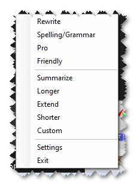

# AITray

AITray is a simple Windows tray application that helps you improve and transform text using Google Gemini. It works directly with text in your clipboard, so you can copy something, modify it, and paste it back seamlessly. With AITray, you can:

- **Rewrite text** to make it clearer, more engaging, or easier to understand.
- **Fix spelling and grammar mistakes** in seconds.
- **Change tone** to make your writing sound more professional or friendly.
- **Summarize or expand content** as needed—shorter for quick overviews or longer for more detail.
- **Use custom prompts** to fit specific text transformation needs.



Watch the video tutorial [here](https://www.youtube.com/watch?v=fZY2syvqx5c) to learn more!

---

## What You Need to Get Started

### 1. .NET 8 SDK

AITray runs on .NET 8, a framework for building applications. If you have Visual Studio 2022, you probably already have it. Otherwise, follow these steps to install:

1. Go to [.NET 8 Downloads](https://dotnet.microsoft.com/en-us/download/dotnet/8.0).
2. Download the version for **Windows** (choose 64-bit unless you know you need 32-bit).
3. Install it by running the downloaded file and following the instructions.

After installation, check if it’s installed correctly:
1. Open a terminal (Command Prompt or PowerShell).
2. Type the command: `dotnet --version` and press **Enter**.
3. You should see a version number like `8.x.x`.

### 2. Google Gemini API Key

You’ll need a key to use the Google Gemini service. Follow these steps to get one:
1. Visit [Google AI Studio](https://aistudio.google.com/app/apikey).
2. Log in with your Google account.
3. Click **Get API Key** and save it somewhere safe—you’ll need it when setting up AITray.

### 3. Optional: Clipboard History (Makes Life Easier)

Enabling Clipboard History lets you see and reuse things you’ve recently copied. To turn it on:
1. Press `Win + I` to open **Settings**.
2. Go to **System** > **Clipboard**.
3. Turn on **Clipboard History**.
4. Press `Win + V` to access your clipboard history anytime.

---

## How to Install AITray

1. **Download AITray**:
   - Go to the [AITray GitHub page](https://github.com/garyexplains/aitray).
   - **Option 1 (Recommended)**:
     - If you have Git installed, open a terminal and type:
       ```bash
       git clone https://github.com/garyexplains/aitray.git
       ```
   - **Option 2 (Beginner-Friendly)**:
     - Click **Code** > **Download ZIP** on the GitHub page.
     - Extract the ZIP file to a folder, such as `C:\aitray`.

2. **Navigate to the Project Folder**:
   - Once extracted, find the folder named **AI Tray** inside the downloaded `aitray` folder.
   - This folder contains the `.csproj` file (the main project file). It’s important to navigate here before running the app.

---

## How to Run AITray

1. Open a terminal (Command Prompt or PowerShell).
2. Change to the **AI Tray** folder where the `.csproj` file is located. For example:
   ```bash
   cd C:\aitray\AI Tray
   ```
3. Run the application with:
   ```bash
   dotnet run
   ```

This will launch AITray, and you’ll see its icon appear in the system tray (the small icons near the clock in the bottom-right corner of your screen).

---

## Using AITray

1. **Set Up Your API Key**:
   - On the first run, the app will ask for your Google Gemini API key. Copy your key and paste it into the Settings window. Click **Save**.

2. **Transform Text**:
   - Copy some text to your clipboard (e.g., highlight text and press `Ctrl + C`).
   - Right-click the AITray icon in the system tray and choose an option (e.g., Rewrite, Summarize, etc.).
   - The modified text will automatically replace what’s in your clipboard—ready to paste anywhere!

---

## Security Considerations

AITray communicates with Google Gemini for text transformations. Avoid using it with sensitive or confidential information to ensure privacy.

---

## Developers
You might be interested in the [AI Tray Developer Documentation](DEVELOPERS.md)
